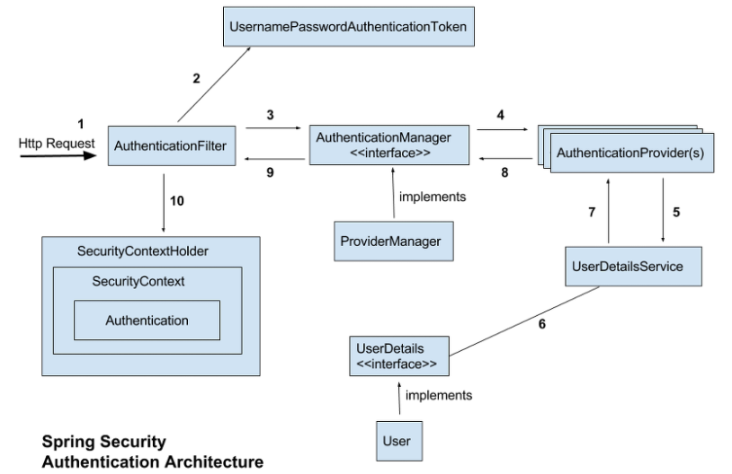
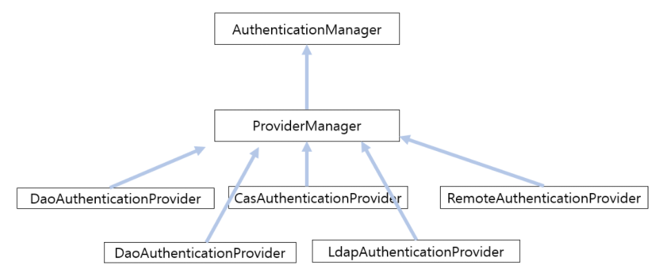

# Spring Web Application
- 주요 사항
    - 성능
    - 사용자 편의성
    - 상호작용, 빠른 응답성
    - 시각적인 풍부함
    - 접근성

- 개발
    - DB 모델링 / 테스트 스크립트 생성
    - DAO 레이어 생성
    - 서비스 레이어 생성
- MVC란?
    - Model: 비즈니스 모델의 데이터, 어플레케이션의 '상태' 데이터 등
    - View: 클라이언트와 닿아있는 상호 작용이 가능한 EndPoint
    - Controller: 서비스 레이어와 상호 작용 및 모델 업데이트 등의 사용자의 요청 처리

---
##### 파일 업로드 처리
- WebConfig에 StandardServletMultipartResolver 클래스를 빈 선언한다.
- WebInitialize에서 Multipart Config에 해당하는 부분을 구현한다.
- ex)
```java
// view
<form:form modelAttribute="singer" id="update" method="post" enctype="multipart/form-data">
....
</form:form>

// controller
@RequestMapping(method=RequestMethod.POST)
public String uploadPhoto(@Valid Singer singer, BindingResult result, Model model, HttpServletRequest request, RedirectAttributes redirect, Locale locale, @RequestPara(value="file", required=false) Part file) {
    byte[] content = null;
    if(file != null) {
        try {
            InputStream stream = file.getInputStream();
            content = IOUtils.toByteArray(stream);
        } catch (IOException ex) {
            ...
        }
        singer.setPhoto(content);
        
        service.save(singer);
        return "redirect:/singers/";
    }
}
```
---
##### Spring Security
- SecurityContext 메모리 세션 저장소를 갖고 있음 
- spring security는 filter 기반으로 동작하기 때문에 spring MVC 와 분리되어 관리 및 동작
- csrf에 대한 enable, disable 설정도 가능

---
- 동작 방식: session, cookie 방식으로 인증
    1. 로그인을 시도하면 user db에서 확인 후 user의 session을 생성
    2. 인메모리 세션 저장소인 SecurityContextHolder에 저장
    3. 사용자에게 session id를 내려줌
    4. 이후 요청부터 cookie에서 JSESSIONID를 확인하여 검증한다.



> https://sjh836.tistory.com/165

> https://bin-repository.tistory.com/128
> 개발자가 스프링 시큐리티를 커스터마이징 하는 방식은 크게 AuthenticationProvider 를 직접 구현하는 방식과 실제 처리를 담당하는 UserDetailsService를 구현하는 방식으로 나누어진다. 대부분의 경우에는 UserDetailsService를 구현하는 형태를 사용하는 것만으로도 충분하지만 새로운 프로토콜이나 인증 구현 방식을 직접 구현하는 경우에는 AuthenticationProvider 인터페이스를 직접 구현해서 사용한다. 