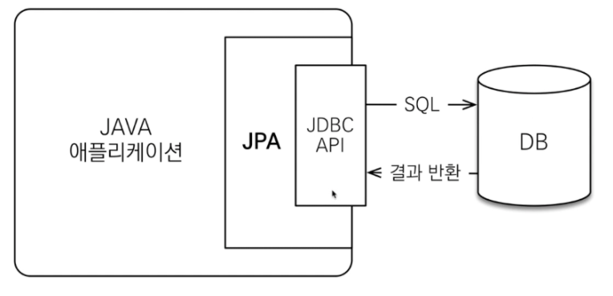

# JPA
- RDB 테이블은 객체지향적 특징(상속, 다형성, 레퍼런스, 오브젝트 등)이 없고 자바와 같은 언어로 접근하기 쉽지 않다. 때문에 ORM을 사용해 오브젝트와 RDB 사이에 존재하는 개념과 접근을 객체지향적으로 다루기 위한 기술이다.
- https://gmlwjd9405.github.io/2019/08/04/what-is-jpa.html

```java
public interface AlbumRepository extends JpaRepository<Album, Long> {
    List<Album> findBySinger(Singer singer);

    @Query("select a from Album a wehere a.title like %:title%")
    List<Album> findByTitle(@Param("title") String title);
}
```
---
### JPQL(Java Persistence Query Language)
    - SQL보다 간단하며 sQL을 추상화해서 특정 데이터베이스에 의존하지 않도록 한다

```java
@Service("jpaSingerService")
@Repository
@Transactional
public class SignerServiceImple implements SingerService {

    final static String SELECT_QUERY = "...";

    @PersistenceContext
    private EntityManager em;

    @Override
    public Singer save(Singer singer) {
        if(singer.getId() == null) {
            em.persist(singer);
        } else {
            em.merge(singer);
        }
        return singer;
    }

    @Override
    public void delete(Singer singer) {
        Singer mergedContact = em.merge(singer);
        em.remove(mergedContact);
    }

    @Transactional(readOnly=true)
    @Override
    public List<Singer> findAllByNativeQuery() {
        return em.createNativeQuery(SELECT_QUERY, "singerResult").getResultList();
    }
}

@Entity
@Table(name="singer")
@SqlResultSetMapping(
    name="singerResult",
    entities=@EntityResult(entityClass=Singer.class)
)
public class Singer implements Serializable {
    ...
}
```

---

### Criteria
- JPQL을 편하게 작성하도록 도와주는 빌더 클래스 모음 API
- query.select(m).where 와 같이 프로그래밍 코드로 JPQL을 작성할 수 있음

```java
//Criteria 사용준비
CriteriaBuilder cb = em.getCriteriaBuilder();
CriteriaQuery<Member> query = cb.createQuery(Member.class);

//루트 클래스 (조회를 시작할 클래스)
Root<Member> m = query.from(Member.class);

//쿼리생성
CriteriaQuery<Member> cq = query.select(m).where(cb.equal(m.get("student_number"), "0991022");
Member member = em.createQuery(cq).getMember();
```

---

### QueryDSL
- JPQL을 편하게 작성하도록 도와주는 빌더 클래스 모음 (비표준 오픈소스)

```java
//준비
JPAQuery query = new JPAQuery(em);
QMember member = QMember.member;

//쿼리, 결과조회
Member member = query.from(member)
                     .where(member.student_number.eq("0991022"))
                     .get(member);
```

---
- Hibernate Envers
    - 엔티티 버전 관리 자동화 특화된 하이버네이트 모듈
---
- EntityListener
    - 엔티티를 db에 적용하기 전/후로 콜백을 요청할 수 있는 어노테이션
    - 여러가지 콜백 시점을 적용할 수 있는 옵션 어노테이션이 존재

```java
@PrePersist // manager persist 의해 처음 호출될 때 실행됩니다.
@PostPersist // manager persist 에 의해 실행되고 불립니다. SQL INSERT 이후에 대응될 수 있습니다.
@PostLoad // 로드 이후에 불립니다. SQL SELECT 이후에 대응될 수 있습니다.
@PreUpdate // SQL UPDATE 이전에 불립니다.
@PostUpdate // SQL UPDATE 이후에 불립니다.
@PreRemove // SQL DELETE 이전에 불립니다.
@PostRemove // SQL DELETE 이후에 불립니다.
```