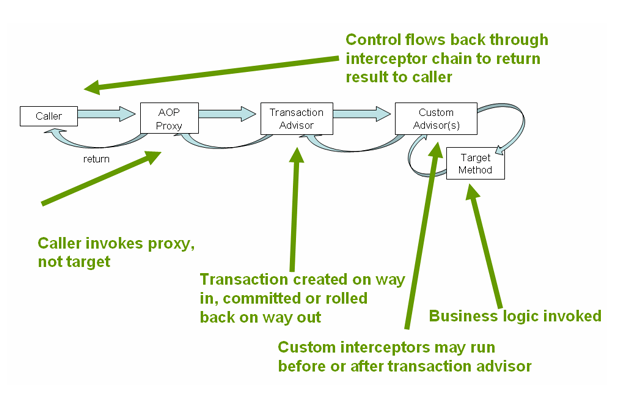
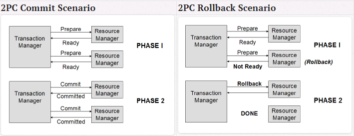
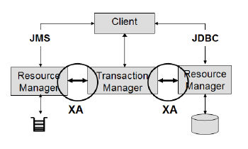
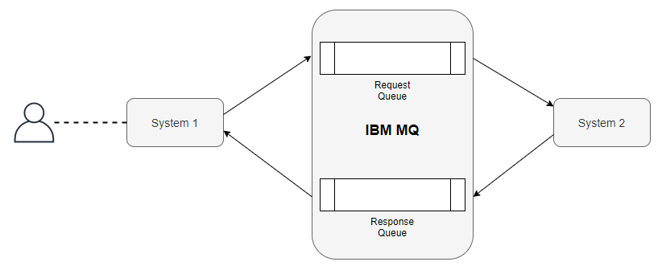
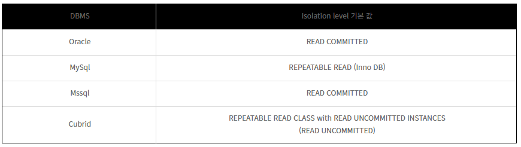

출처: https://layered.tistory.com/entry/번역-JTA와-XA

# Trancaction 관리

### 내용
- 일반적으로 백엔드 리소스 공급 업체는 리소스 매니저를 제공한다. 예를 들어 MySQL 데이터베이스를 연결할때 MySQL 자바 커넥터가 제공하는 MysqlXADataSource 클래스를 사용해 접근해야 한다.
- 스프링은 PlatformTransactionManager 인터페이스의 다양한 구현체를 제공하며 각각의 DataSource, JTA, JMS, JPA, Hibernate trancationManager를 포함하는 구현체들이 있다.
- PlatformTransactionManager에는 TransactionDefinition에 인터페이스로 트랜잭션을 관리하는 설정과 책임을 캡슐화했습니다.

---
### 용어 정리
- 선언적 트랜잭션
    - Transaction Template와 달리 트랜잭션 처리를 코드에서 직접적으로 수행하지 않음
    - `<tx:advice>` 태그를 이용한 방법
    - `@transaction` 어노테이션을 이용한 방법
    - 스프링 프레임워크는 선언적 트랜잭션 관리와 프로그래밍 방식 트랜잭션 관리를 제공한다. 대부분 선언적 트랜잭션 관리가 선호되는데, 이 방식은 거의 모든 상황에 적합하다.


- JTA(Java Transaction API)
    - 플랫폼마다 상이한 트랜잭션 매니저들과 어플리케이션들이 상호작용할 수 있는 인터페이스를 정의, 실제 구현은 다르지만 어플리케이션이 공통적으로 사용할 수 있는 하나의 인터페이스를 제공
<br>

- XA(eXtended Architecture) 프로토콜
    - 동일한 전역 트랜잭션(Global Transaction) 내에서 몇 개의 백엔드 데이터 저장소에 접근하기 위한 X/Open 그룹 표준의 하나
    - XA 표준 규격은 하나의 트랜잭션 매니저가 어떤 트랜잭션의 한 부분으로 어떤 작업이 수행되고 있는지를 데이터베이스에 통보하는 방식과, 각 트랜잭션이 완료될 때 2단계 커밋(2 Phase Commit)을 수행되는 방식을 관장한다. 또 데이터 저장소에서 지연되고 있는 트랜잭션을 회복시키는 방법도 포함하고 있다.
    - JTA와 XA는 데이터가 오염되는 것(그리고 그로 인한 사업상의 손실)을 막아주는 일종의 보험 시스템
    - 일반적으로 하나 이상의 백엔드 시스템에 대해 동일 트랜잭션으로 여러 작업을 수행해야 하는 경우에 JTA/XA의 사용을 강하게 권고한다

```
X/Open XA는 X/Open이 제정한 분산 트랜잭션 처리를 위한 표준이다. 보통 멀티 트랜잭션 관리자와 로컬 리소스 관리자 사이의 인터페이스를 규정하고 있고, XA에서는 리소스 관리자가 트랜잭션을 처리하기 위해 필요한 것을 규정하고 있다.

2단계 커밋 프로토콜은 트랜잭션을 커밋할지, 아니면 롤백할지에 대해 분산 원자적 트랜잭션에 관여하는 분산 알고리즘의 하나이다.

Global Transaction, 2PC(2 Phase Commit): begin > end > prepare > commit
Local Transaction, 1PC(1 Phase Commit): begin > end > commit

- 2단계 커밋 흐름 예시
> TM은 ‘트랜잭션 시작’ 이라는 내용을 로그파일에 작성하고, RM에게 트랜잭션에 대한 요청을 보낸다.
> RM들은 참여하고 있는 디비는 자신의 로그에 트랜잭션을 기재하고 다른 사용자가 접근 못하게 락을 설정하고 작업을 수행한 뒤 커밋할 준비가 되었다고 TM에게 응답한다.
> TM은 커밋할 준비가 되었다는 메세지를 받고 ‘트랜잭선 종료’를 로그에 기록한 뒤, RM들에게 커밋 하라고 통보한다.
> RM들은 이 사실을 트랜잭션 로그에 기록한뒤 커밋을 하고 락을 푼다.
만약 커밋하기전에 참여 RM중 문제가 발생하면 TM은 롤백하라고 RM들에게 통보한다.
```



<br>

- JMS(Java Message Service)
    - SUN에서 만들어진 엔터프라이즈 메시징을 위한 API로서 메시징 시스템 자체만이 아니라 메시징 시스템과 통신하는 메시지 클라이언트에서 필요한 클래스와 인터페이스에 대한 추상화도 포함한다.
    - 메시지 전달 방법에 영속적(persistent)인 방법과 비영속적(nonpersistent)인 방법이 있으며, 수신자가 수신이 가능하지 못 할 경우에 메시지 서버가 영속장치에 메시지를 저장하고 수신자의 수신이 가능해지면 모든 메시지를 받게하는 보장된 전달을 수행한다.
    - Sender와 Receiver간의 TCP 패킷을 정의하여 통신하는 Interface-centric 방식의 통신이 아닌 Data-centric(데이터 중심의)방식으로 메시지를 주고 받는데 Sender와 Receiver간의 약속이 필요하지 않다
    - 메시지는 Header, Property, Body 3부분으로 구성된다.
    - 자바 메시지 서비스는 자바 플랫폼, 엔터프라이즈 에디션에 기반을 둔 애플리케이션 컴포넌트들끼리 메시지를 생성, 송/수신, 읽기 기능을 제공하는 메시징 표준이다. 분산된 애플리케이션끼리 느슨하게 연결해주고 신뢰성을 보장하며, 비동기 처리가 가능하도록 한다
<br>

- MQ 서버
    - MQ의 신뢰성의 핵심인 "단 한 번 만에 전달" 
    - MQ는 비동기 메시징 환경에서 애플리케이션 간의 완충 역할을 수행합니다. 네트워크 또는 애플리케이션 중단이 발생하면 모두 정상화될 때까지 메시지를 특수 큐에 보관합니다.
    - 방대한 양의 데이터가 메시지로서 언제든 애플리케이션, 시스템 및 서비스 간에 이동합니다. 애플리케이션이 준비되지 않았거나 서비스 인터럽트가 발생하면 메시지와 트랜잭션이 유실되거나 중복될 수 있으며, 이를 바로 잡으려면 비즈니스 시간과 비용이라는 대가를 치러야 합니다. 
    IBM은 시장에서 25년 넘게 MQ를 능숙하게 개선해 왔습니다. MQ를 사용하면 메시지를 즉시 전달할 수 없는 경우 전달이 보장될 때까지 해당 메시지가 대기 중인 큐에서 보호됩니다. 경쟁자들은 메시지를 두 번 전달하거나 전혀 전달하지 않을 수 있지만, MQ는 파일 데이터를 포함한 데이터를 오직 한 번만 이동합니다. MQ에서는 메시지 유실이 없습니다.

> IBM MQ 9 JMS with Spring boot


---

### TransactionDefinition Interface
```java
pakage org.springframework.transaction;
import java.sql.Connection;
public interface TransactionDefinition {
    ...

    int getPropagationBehavior();
    int getIsolationLevel();
    int getTimeout();
    boolean isReadOnly();
    String getName();
}
```
- Isolation level
    - DEFAULT: 기본 격리 수준, DB의 isolation level을 따름
    - READ_UNCOMMITTED(0): 가장 낮은 격리 수준, 커밋하지 않은 수정데이터 읽기 가능
    - READ_COMMITTED(1): 대부분의 데이터베이스 기본 수준, 커밋하지 않은 데이터 읽기 불가능. 데이터를 읽은 상태에서 다른 트랜잭션이 데이터 수정 가능
    - REPEATABLE_READ(2): 트랜잭션 내에서 한번 데이터를 읽어오면 다시 읽을때마다 동일한 데이터를 읽음. 데이터를 읽은 상태에서 다른 트랜잭션이 수정은 불가능하나 삽입은 가능. 삽입된 데이터는 읽기도 가능.
    - SERIALIZABLE(3): 가장 비용이 크고 신뢰도 높음 격리 수준. 모든 트랜잭션은 하나씩 차례대로 실행되는 것처럼 처리됨. 유지보수 비용이 크게 발생
<br>

- PropagationBehavior: 새로운 트랜잭션이 발생할때 처리방법에 대한 옵션
    - REQUIRED: 이미 존재하는 트랜잭션을 지원하고 없으면 새 트랜잭션을 생성
    - SUPPORTS: 존재하는 트랜잭션 지원하고 없으면 nontransactionally
    - MANDTORY: 존재하는 트랜잭션 지원하고 없으면 예외
    - REQUIRES_NEW: 항상 새로운 트랜잭션을 시작, 이미 있다면 일시 중단
    - NOT_SUPPORTED: 진행 중인 트랜잭션이 있다면 일시 중단, 항상 비트랜잭션 실행
    - NEVER: 진행 중인 트랜잭션이 있다면 예외, 항상 비트랜잭션 실행
    - NESTED: 진행 중인 트랜잭션이 있다면 중첩 트랜잭션으로 실행, 없으면 REQUIRED
<br>

- @Transactional
    - annotation 기반으로 트랜잭션을 관리할 때 적용
    - 기본적으로 스프링은 클래스 내의 각 메서드 실행 전에 트랜잭션이 존재함을 보장
    - 어노테이션을 함수에 넣어 재정의 가능
    - 일반적으로 모든 find 메서드에는 readOnly attribute가 적용되어야 함, 퍼시스턴스 제공자가 read-only 트랜잭션에 대해 일정한 수준으로 최적화를 수행, 예를 들어 하이버네이트는 read-only 상태에서 데이터베이스에서 조회한 관리 대상 인스턴스의 스냅샷을 유지하지 않음

```java
@Transactioanl
public class ModelImpl implements ModelService {
    
    @Override
    @Transactional(readOnly = true) // mode: read-only
    public List<Model> findAll() {
        return ...;
    }

    @Override
    public Model save() { // mode: read-write
        ...
    }

    // attributre를 사용하지 않은 경우 transaction default 값
    // propagation: required
    // isolation: default
    // timeout: default
    // mode: read-write
}
```



--- 

### 참고글 
> https://12bme.tistory.com/386
https://parkcheolu.tistory.com/35
https://manhyuk.github.io/transaction/
https://fizalihsan.github.io/technology/transaction.html