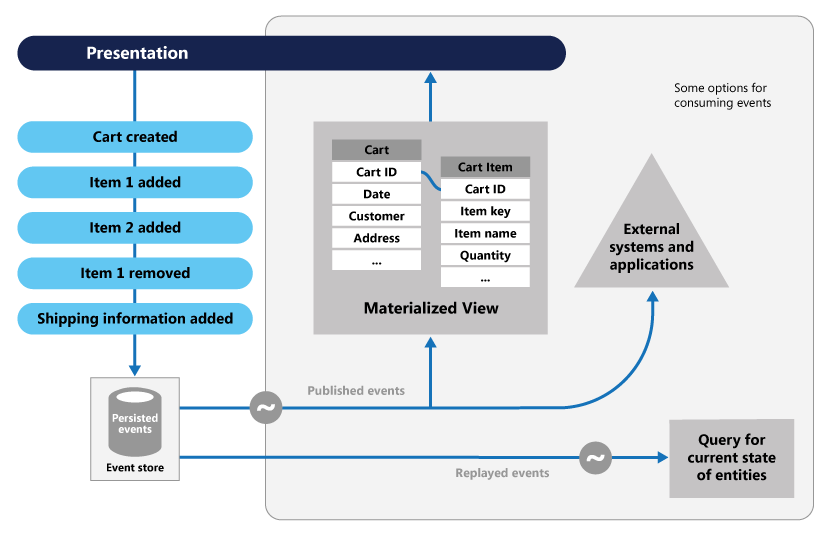

# Event Sourcing

### why?
전통적인 CRUD 아키텍처 기반에서 Application을 개발 및 운영하다 보면 자연스레 Domain Model의 복잡도가 증가되기 마련이고 이로 인해 유지보수 Cost는 지속적으로 증가하게 되며 Domain Model은 점점 설계 시 의도한 방향과는 다르게 변질 되게 된다. 특히나 요즘처럼 고차원적인 UX(User eXperience), 급변하는 Business, 시도때도 없이 달라지는 요구사항을 충족하는 Model을 만드는건 더욱더 어려운일이 되어버렸다.

### 설명
- 데이터 저장 방법에 대한 개념으로 물리적인 데이터 결과 값이 아닌 순차적으로 발생하는 이벤트를 모두 저장하는 방식이다
- 예를 들어, 사용자가 상품을 주문하고 취소한 다음, 다른 상품을 담아서 다시 주문한 경우, 기존의 방식은 주문에 대한 결과만 저장하는 것에 비해 이벤트 소싱은 모든 이벤트를 저장
- 때문에, Update or Delete 라는 개념이 없다
- 최종 값을 알기 위해 순차적으로 이벤트를 재생하면 얻을 수 있으나, 이벤트의 개수가 많아지는 경우 처리시간이 길어지기 때문에 스냅샷 개념을 도입. ex) 1000번째 결과는 x 이므로 1001번째 이벤트부터 재생

### 장점
- 데이터 모델과 비즈니스 도메인을 동기화할 필요가 없고 성능, 확장성 및 응답성이 향상되므로 복잡한 도메인의 태스크를 간소화 할 수 있다. 또한 트랜잭션 데이터에 일관성을 제공하고 보정 작업에 사용할 수 있는 전체 감사 추적 및 기록을 유지할 수 있다
- 데이터 저장소의 개체를 직접 업데이트하지 않아도 되기 때문에 동시 업데이트로 인한 충돌을 방지할 수 있고 트랜잭션 처리 중 경합이 없어서 사용자 인터페이스에서 애플리케이션의 성능과 확장성이 훨씬 향상된다
- 이벤트는 일부 작업을 설명하는 단순 개체일 뿐이므로 구현 및 관리를 간소화 할 수 있다
- 테이블은 시스템의 현재 상태를 나타내지만 이벤트 흐름은 도메인 전문가에게 의미가 있다
- 현재 상태와 저장하는 경우와 달리 취소된 변경 기록이 제공되고 언제든지 이벤트를 재생하여 현재 상태를 재생성하고 시스템 테스트 및 디버그를 지원할 수 있다
- 도메인 모델을 관계형 데이터베이스에 투영할 때에는 다양한 구조적 문제들이 발생하며 이것을 개체-관계형 임피던스 불일치(Object-Relational Impedance Mismatch)라고 한다. ORM 등의 도구를 사용해 반복작업을 줄일 수는 있지만 근본적인 해결책은 아니다. 반면 이벤트 소싱을 사용하면 도메인 모델은 직렬화된(serialized) 도메인 이벤트의 집합으로 저장되기 때문에 임피던스 불일치가 발생하지 않는다.

### 기존 CRUD 시스템의 문제점
- 데이터 저장소에서 직접 업데이트 작업을 수행하므로 성능 및 응답 속도가 저하되고 필요한 처리 오버헤드로 인해 확장성이 제한될 수 있다
- 각 작업의 세부 정보를 개별 로그에 기록하는 추가 감사 매커니즘이 없으면 기록이 유실된다
- 많은 동시 사용자가 있는 공동 작업 도메인에서 데이터 업데이트 충돌은 대체로 업데이트 작업이 단일 데이터 항목에서 수행되기 때문에 발생한다.

### 다른 기술과의 조합
- CQRS
이벤트 소싱은 가파른 학습곡선 등 단점도 가진다. 그 중 가장 치명적인 것은 이벤트 저장소가 비즈니스의 다양한 데이터 조회 요구를 수용하기 어렵다는 점이다. 이런 문제를 해결하기 위해 이벤트 소싱은 항상 CQRS(Command and Query Responsibility Segregation)와 함께 사용된다. 이벤트 소싱이 CQRS와 함께 사용되면 도메인 모델은 비즈니스 요구에 적합한 다양한 비정규(denormalized) 형상을 가질 수 있다.

- 도메인 주도 설계(Domain-Driven Design)
CQRS의 창시자인 Greg Young은 도메인 주도 설계의 고통을 해결하기 위해 CQRS를 사용했다고 말했다. 따라서 CQRS와 관련된 많은 요소들은 도메인 주도 설계에 기반한다. 이벤트 소싱 역시 그렇다. 이미 눈치챘겠지만 수차례 사용한 집합체(aggregate)라는 용어는 도메인 주도 설계에서 왔다. 이벤트 소싱을 사용한 시스템을 만들 때 도메인 주도 설계에서 많은 통찰력을 얻을 수 있다.

- 마이크로서비스 아키텍처(Microservices Architecture)
많은 프로그래머와 아키텍트들이 마이크로서비스 아키텍처에 메시지 중심의 비동기 작업 흐름을 도입해야 한다고 말하며 이미 관련 제품들이 출시되고 도입되고 있다. 그리고 어떤 사람들은 이런 성숙과정의 마지막에 이벤트 소싱을 배치하기도 한다. 이벤트 소싱이 반드시 마이크로서비스 아키텍처에서 사용되어야 하는 것은 아니지만 이벤트 소싱과 비동기 마이크로서비스 아키텍처는 서로 잘 들어맞아 시너지를 만든다.

### 참고글
> https://cyberx.tistory.com/98

https://docs.microsoft.com/ko-kr/azure/architecture/patterns/event-sourcing
https://medium.com/@mjspring/%EC%9D%B4%EB%B2%A4%ED%8A%B8-%EC%86%8C%EC%8B%B1-event-sourcing-%EA%B0%9C%EB%85%90-50029f50f78c
https://justhackem.wordpress.com/2017/02/05/introducing-event-sourcing/